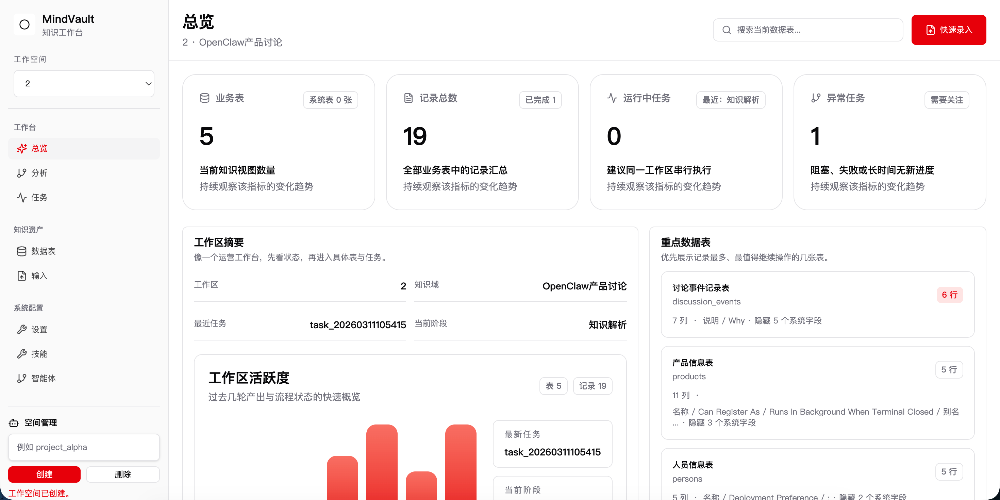
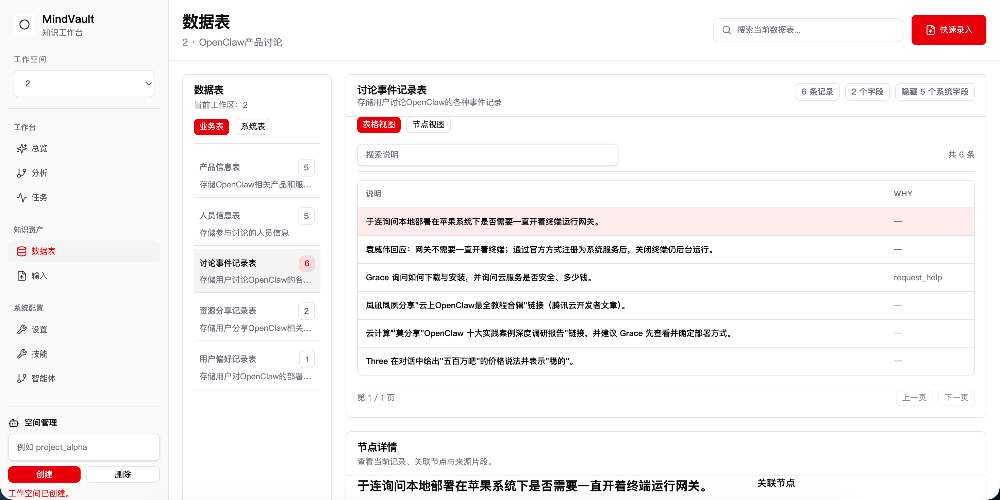
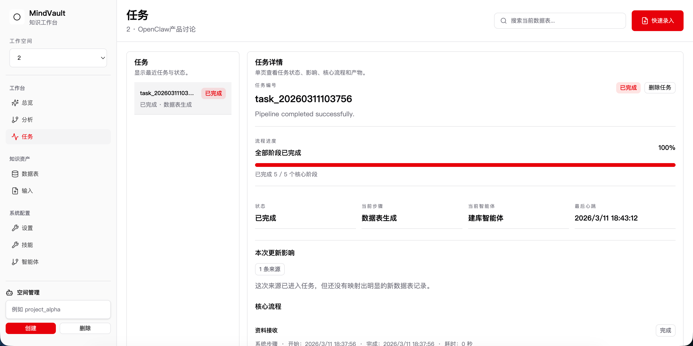
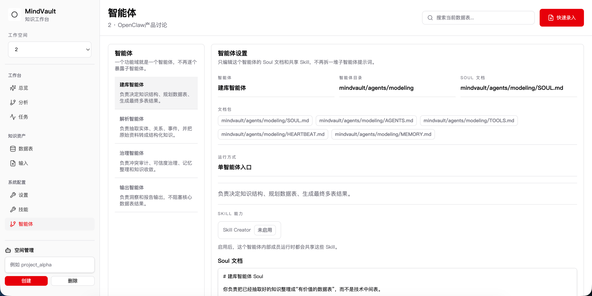

# MindVault

<p align="center">
  <b>Agent 驱动的 AI 知识系统</b><br/>
  把聊天、文档、表格中的碎片信息，沉淀成可追溯、可治理、可持续演化的知识资产。
</p>

<p align="center">
  <a href="#quick-start">Quick Start</a> ·
  <a href="#core-capabilities">Core Capabilities</a> ·
  <a href="#how-it-works">How It Works</a> ·
  <a href="#current-structure">Structure</a>
</p>

---

## At a glance

MindVault 将原始信息先抽象为带证据链的 **claims**（含来源与置信度），再合并为可演化的 **Canonical Knowledge Base**。

- **可追溯**：每条知识都有来源引用与信心分数
- **可治理**：自动识别冲突、缺失字段、Schema 演化候选
- **可回放**：每次运行生成 snapshot 与 changelog
- **可读**：输出 Markdown 报告、Dashboard、图谱数据


MindVault 不是一个只会“抽取字段”的工具，它更像一个持续运行的知识引擎。系统可以读取聊天记录、文档、表格、报告等多种数据源，通过多个 Agent 自动抽取实体、关系和事件，再将这些信息组织成一个不断更新的结构化知识库。

和传统的一次性信息抽取不同，MindVault 关注的不只是“抽出来了什么”，也关注“为什么是这个结果”。它会记录来源、计算置信度、识别冲突、追踪缺失字段，并在每次运行后生成知识快照、变更记录、治理结果和可视化报告，让知识真正具备长期积累和持续演化的能力。


## Product Screenshots

下面预留了几张核心界面的图片位置。你后面只需要把图片放到 `docs/images/` 目录，并使用下面建议的文件名即可。

### 1. 工作台总览

建议文件名：`docs/images/overview.png`



### 2. 数据表与分析视图

建议文件名：`docs/images/tables-and-analysis.png`



### 3. 任务追踪与运行状态

建议文件名：`docs/images/tasks.png`



### 4. 技能、智能体与系统配置

建议文件名：`docs/images/agents-and-settings.png`




## Why MindVault

现实世界里的知识从来都不整齐。

它散落在聊天记录里，埋在文档里，藏在表格里，更新在新的报告和讨论里。不同来源会给出不同说法，数据会不断变化，旧结论会被新信息推翻。大多数抽取系统只能完成“文本进来，结果出去”这一步，但真正困难的部分，其实发生在抽取之后。

- 哪条信息更可信？
- 不同来源冲突时该怎么处理？
- 缺失字段如何持续补全？
- 新数据进来后，旧知识如何更新？
- 知识结构变化时，schema 如何演化？

MindVault 想做的，就是把这些问题一起纳入系统，而不是假装它们不存在。


## What It Does

MindVault 会把原始信息先转成带有来源和置信度的 **claims**，再逐步合并为 **Canonical Knowledge Base**。这样系统不仅能保留证据链，还能处理冲突、追踪变化，并让整个知识演化过程可回放、可审计。

每次运行后，你会得到：

- **Canonical Knowledge Base**：规范化后的知识结果
- **Governance Outputs**：冲突、占位符、Schema 候选等治理文件
- **Snapshots + Changelog**：知识快照与变更记录
- **Reports + Dashboard**：适合人类查看的报告和可视化面板


## Example Use Cases

### 金融数据库

将新闻、研报、财报、访谈和会议纪要输入系统，自动提取公司、融资事件、估值、收购关系、高管变动等信息，并记录来源、识别冲突、计算置信度，逐步形成一个可追溯的金融知识底座。

### 企业内部知识库

把飞书、Slack、Notion、文档、表格里的分散信息沉淀为结构化知识，用于构建项目知识图谱、决策记录系统、组织知识库，或者作为内部 AI Agent 的长期记忆层。

### 行业研究与知识图谱

适用于行业信息跟踪、研究数据库、投研系统等场景，尤其适合那些知识需要持续积累、持续更新、持续治理的任务。


## Core Capabilities

- **Agent-driven pipeline**：多个 Agent 协同完成抽取、整理、合并与报告生成
- **Claim intermediate layer**：先形成 claims / candidates，再合并到 canonical 层
- **Unified confidence model**：统一管理 `confidence`、`source_refs`、`status`、`updated_at`
- **Conflict governance**：自动识别冲突并输出治理结果
- **Placeholder lifecycle**：持续追踪缺失字段，不让信息空洞悄悄溜走
- **Schema evolution**：新字段先进入候选池，再按规则晋升
- **Versioning**：每次运行生成 snapshot 和 changelog
- **Workspace isolation**：不同 workspace 的知识状态互不污染
- **Readable outputs**：自动生成 Markdown 报告、Dashboard 和图谱数据


## How It Works

```text
Raw Data
   ↓
Ingestion
   ↓
Claim Extraction
   ↓
Knowledge Merge
   ↓
Governance
   ↓
Version Snapshot
   ↓
Reports & Dashboard
````


## Quick Start

安装依赖：

```bash
pip install -r requirements.txt
```

运行一个样例：

```bash
python3 -m mindvault.runtime.app -w workspace -i sample_data/benchmarks/semi_structured.json
```

启动前端查看器：

```bash
cd frontend
npm run dev
```

默认访问地址：

```bash
http://localhost:4310
```

### Quick Start UI Placeholder

如果你希望在快速开始附近再放一张主界面截图，可以使用下面这个位置。

建议文件名：`docs/images/quick-start-ui.png`


## Current Structure

当前项目已经收成三层：

```text
MindVault/
├─ frontend/                 # Node.js 工作台与 API
├─ config/                   # 模型、运行方式、技能、四智能体配置
├─ docs/                     # 架构说明
├─ tests/                    # Python 回归测试
├─ main.py                   # 兼容入口，转发到当前 runtime
├─ parser.py                 # 本地 fallback 解析器
├─ claim_model.py            # fallback 解析器使用的数据模型
└─ mindvault/
   ├─ adapters/              # source -> chunk 适配
   ├─ agents/                # 智能体定义 + 四个主智能体文档目录
   │  ├─ *.yaml              # 内部执行定义
   │  ├─ parsing/
   │  ├─ governance/
   │  ├─ modeling/
   │  └─ publishing/
   ├─ governance/            # 可信治理引擎
   ├─ prompts/               # LLM 提示模板
   ├─ runtime/               # 当前 Python 知识引擎主链
   └─ schemas/               # 结构定义
```

### What Was Removed

下面这些旧版 mesh / legacy pipeline 文件已经移除：

- 根目录旧 runtime / mesh / visualizer / versioning / ingestion 相关 Python 文件
- 旧的 `llm/` Python 封装
- 未使用的 `mindvault/runtime/workflow_engine.py`
- 未使用的 `mindvault/runtime/renderers/dashboard.py`

现在主入口只有两条：

- Web: `frontend/server.mjs`
- Python: `python3 -m mindvault.runtime.app`


## Vision

MindVault 的目标不是再做一个“文本抽取工具”，而是构建一个真正可以长期运行的 AI 知识系统。

我们相信，未来很多 Agent 系统需要的不只是更强的模型，还需要一个能够持续积累、持续治理、持续演化的知识底座。模型负责理解世界，知识系统负责记住世界，而 MindVault 想把这层“记忆”做得更可靠一些。


## Current Status

MindVault 目前仍处于早期阶段，但核心方向已经明确：从一次性抽取，走向可治理、可追溯、可持续演化的知识系统。
