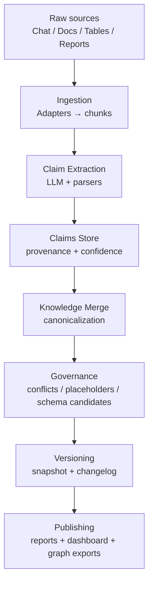

# Architecture

MindVault is an **agent-driven knowledge system**.

At a high level, it turns messy, multi-source information into **claims** (with provenance + confidence), then merges them into an evolving **Canonical Knowledge Base** with governance outputs.

## Pipeline

## Key ideas

- **Claims as intermediate representation**: retain evidence and allow conflict-aware merging.
- **Governance outputs**: treat conflicts/missing fields/schema evolution as first-class artifacts.
- **Versioned knowledge**: snapshots + changelog make evolution auditable and replayable.

## Code map

- `mindvault/adapters/` — source → chunks
- `mindvault/agents/` — agent definitions and prompt configs
- `mindvault/governance/` — conflict & schema governance
- `mindvault/runtime/` — main orchestration runtime
- `frontend/` — viewer / workbench UI
